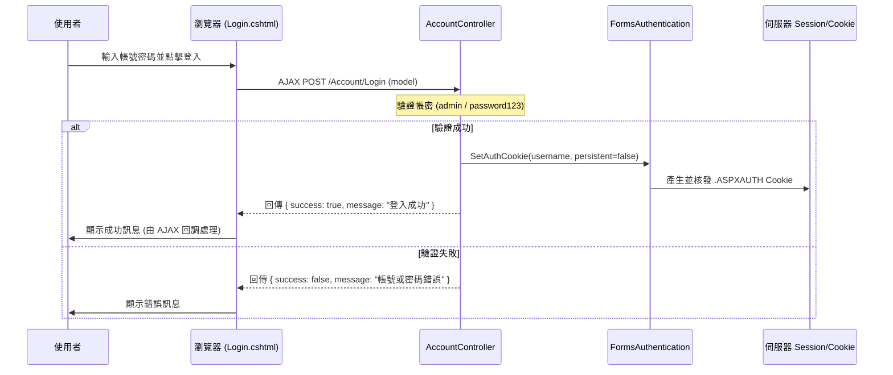
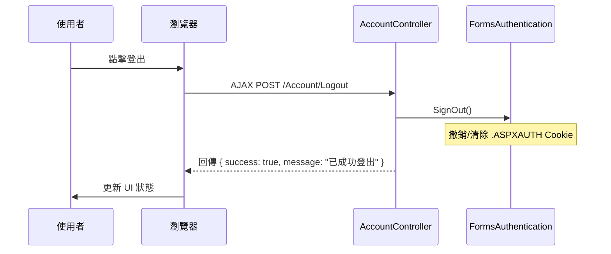

# 登入邏輯分析 (參考 APiAuth 專案)

此文件分析了 `APiAuth` 專案中的登入處理流程。雖然 `winSleep` 本身不包含登入功能，但此文件可作為 workspace 中相關功能的參考。

## 1. 登入流程說明

### 前端 (Login.cshtml)
- 使用 **jQuery AJAX** 發送 `POST` 請求到 `/Account/Login`。
- 傳送資料包含 `Username` 與 `Password`。
- 根據伺服器回傳的 JSON 結果 (`success`, `message`) 更新 UI。

### 後端 (AccountController.cs)
- **驗證**: 檢查帳號是否為 `admin` 且密碼為 `password123`。
- **授權**: 驗證成功後，調用 `FormsAuthentication.SetAuthCookie` 核發身份驗證 Cookie (通行證)。
- **回應**: 回傳 JSON 格式的成功或失敗訊息。

## 2. 登入時序圖 (Sequence Diagram)

## 3. 登出流程 (Logout)

