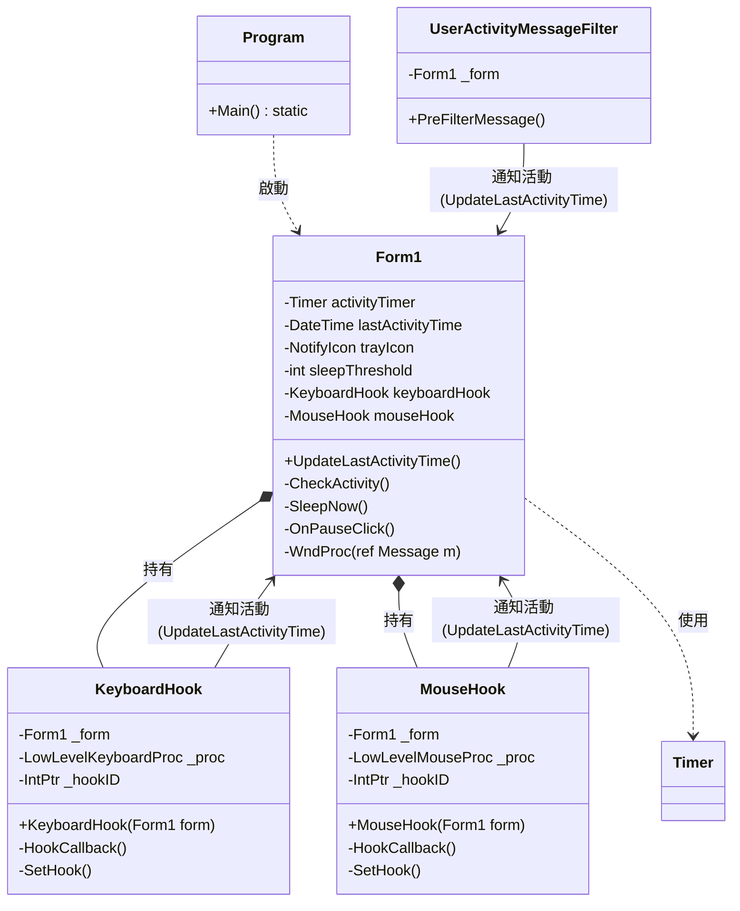
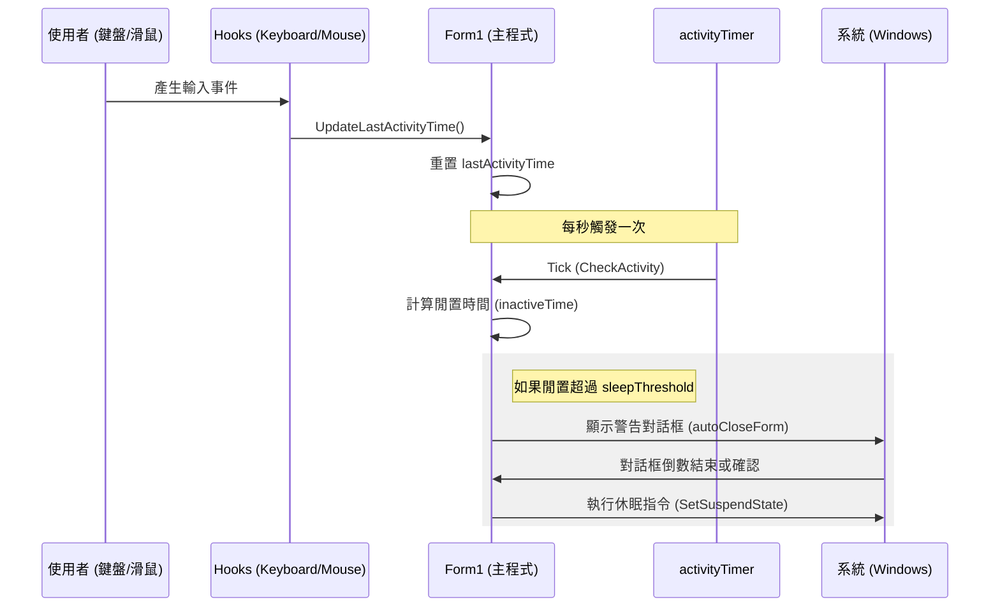
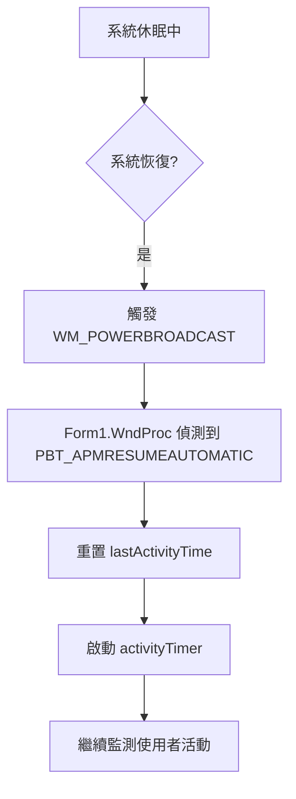

# winSleep Mermaid 圖表

此文件包含了 winSleep 專案的架構與流程圖。

## 1. 類別圖 (Class Diagram)

```mermaid
classDiagram
    class Program {
        +Main() static
    }

    class Form1 {
        -Timer activityTimer
        -DateTime lastActivityTime
        -NotifyIcon trayIcon
        -int sleepThreshold
        -KeyboardHook keyboardHook
        -MouseHook mouseHook
        +UpdateLastActivityTime()
        -CheckActivity()
        -SleepNow()
        -OnPauseClick()
        -WndProc(ref Message m)
    }

    class KeyboardHook {
        -Form1 _form
        -LowLevelKeyboardProc _proc
        -IntPtr _hookID
        +KeyboardHook(Form1 form)
        -HookCallback()
        -SetHook()
    }

    class MouseHook {
        -Form1 _form
        -LowLevelMouseProc _proc
        -IntPtr _hookID
        +MouseHook(Form1 form)
        -HookCallback()
        -SetHook()
    }

    class UserActivityMessageFilter {
        -Form1 _form
        +PreFilterMessage()
    }

    Program ..> Form1 : 啟動
    Form1 *-- KeyboardHook : 持有
    Form1 *-- MouseHook : 持有
    KeyboardHook --> Form1 : 通知活動 (UpdateLastActivityTime)
    MouseHook --> Form1 : 通知活動 (UpdateLastActivityTime)
    UserActivityMessageFilter --> Form1 : 通知活動 (UpdateLastActivityTime)
    Form1 ..> Timer : 使用
```

## 2. 系統運作時序圖 (Sequence Diagram)

```mermaid
sequenceDiagram
    participant U as 使用者 (鍵盤/滑鼠)
    participant H as Hooks (Keyboard/Mouse)
    participant F as Form1 (主程式)
    participant T as activityTimer
    participant SY as 系統 (Windows)

    U->>H: 產生輸入事件
    H->>F: UpdateLastActivityTime()
    F->>F: 重置 lastActivityTime

    Note over F,T: 每秒觸發一次
    T->>F: Tick (CheckActivity)
    F->>F: 計算閒置時間 (inactiveTime)
    
    rect rgb(240, 240, 240)
        Note right of F: 如果閒置超過 sleepThreshold
        F->>SY: 顯示警告對話框 (autoCloseForm)
        SY->>F: 對話框倒數結束或確認
        F->>SY: 執行休眠指令 (SetSuspendState)
    end
```

## 3. 系統恢復流程圖 (Activity Diagram)

```mermaid
graph TD
    A[系統休眠中] --> B{系統恢復?}
    B -- 是 --> C[觸發 WM_POWERBROADCAST]
    C --> D[Form1.WndProc 偵測到 PBT_APMRESUMEAUTOMATIC]
    D --> E[重置 lastActivityTime]
    E --> F[啟動 activityTimer]
    F --> G[繼續監測使用者活動]
```
